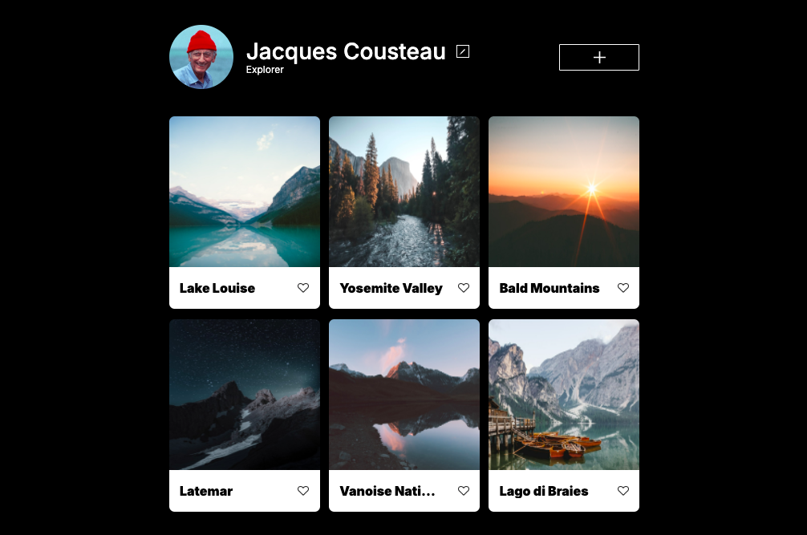

# Project 3: Around the U.S.

## Description & Functionality

This is a website desinged to simulate a user account where people can upload different photos. The user would have a profile picture which they can edit at any time, an option to add new photos or remove/update old ones, and the ability to see the photos they have uploaded to the site. Users who see the profile can like the pictures that are posted as well by pressing the "like button"

## Technologies & Techniques used

The main programs used for this project were VSCode incorporating HTML and CSS to make the overall design. Figma contained a prelimarary view of the website which I used as a refrence to use in the design phase. The internet was also used for information and to search solutions for code errors.

Some of the techniques used were media querys which helped make the website responsive in it's overall design. It can be viewed on desktop, tablet and mobile and the size of the page will adjust accordingly. Other techniques used included:

1. Grid Layout
2. Flexbox Layout
3. Font upload & Implementation
4. Github updating
5. BEM Methodolody

## Pictures of Page

## Github Link

[Github](https://dohstarks3.github.io/se_project_aroundtheus/)

## Prject 3 Video Link

